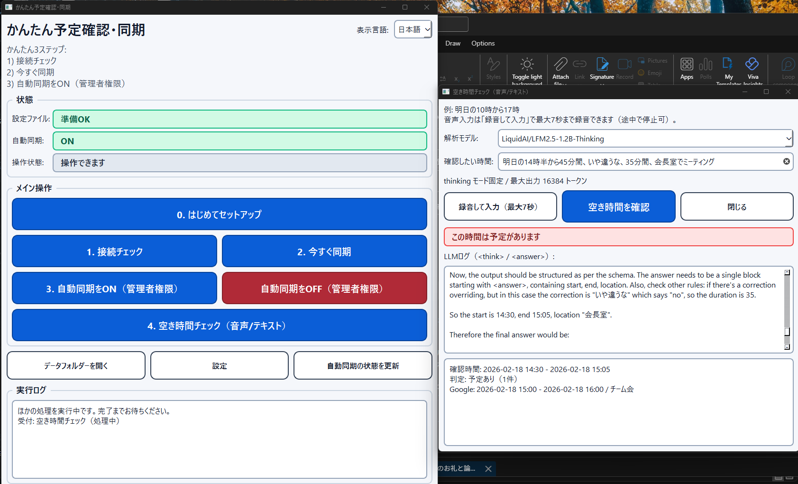

# かんたん予定確認・同期（BridgeCal）

[English README](README.en.md)

かんたん予定確認・同期（内部名: BridgeCal）は、2 つのカレンダーを同期する **単一ユーザー向け**・**ローカル実行** の同期エージェントです。

- Microsoft Outlook デスクトップ カレンダー（A 社、Windows、Graph/EWS 不可）
- Google カレンダー（B 社）

エージェントは A 社 PC の電源が入っている間だけ動作します。

## クイックスタート（開発）

```bash
uv sync
uv run bridgecal doctor
uv run bridgecal sync --once
uv run bridgecal availability --text "明日の10時から17時"
uv run bridgecal gui
```

## Windows へのデプロイ

かんたん予定確認・同期（BridgeCal）の実行には以下が必要です。
- Outlook デスクトップがそのマシンで設定済みであること（COM アクセス）
- OAuth **Desktop app** 用の Google OAuth クライアントシークレット JSON
- Python 3.12 以上
- 初回の空き時間チェック時は、ローカル LFM モデル取得で時間がかかることがあります

Google API キーは不要です。

### ワンコマンドデプロイ（PowerShell）

リポジトリのルートで実行してください。

```powershell
powershell -NoProfile -ExecutionPolicy Bypass -File .\scripts\deploy-bridgecal.ps1
```

このスクリプトで実行される内容:
- Python 3.12+ がなければ `winget` でインストール
- `uv` がなければ `winget` でインストール（失敗時は公式インストーラにフォールバック）
- `uv sync` を実行
- `%APPDATA%\BridgeCal\config.toml` を作成
- Google カレンダー ID を対話で入力
- Google OAuth クライアントシークレットを対話で入力（ファイルパスまたは JSON 貼り付け）
- `uv run bridgecal doctor` を実行
- 任意で `uv run bridgecal sync --once` を初回実行
- 任意でログオン時起動のタスクスケジューラを作成

注意: Outlook はこのスクリプトではインストールされません。Outlook デスクトップは事前にインストール・設定が必要です。

オプション:

```powershell
.\scripts\deploy-bridgecal.ps1 -IntervalSeconds 120 -SkipScheduledTask
```

### デーモン起動用スクリプト

必要に応じて直接実行できます（タスクスケジューラの Action 用）。

```powershell
.\scripts\run-bridgecal-daemon.ps1 -IntervalSeconds 120 -ConfigPath "$env:APPDATA\BridgeCal\config.toml"
```

### 任意: Windows GUI（手動同期 + スケジューラ設定）

起動:

```powershell
uv run bridgecal gui --config "$env:APPDATA\BridgeCal\config.toml"
```

依存関係の自動インストールを含めて GUI を起動する場合:

```powershell
powershell -NoProfile -ExecutionPolicy Bypass -File .\scripts\run-bridgecal-gui.ps1
```

オプション:

```powershell
.\scripts\run-bridgecal-gui.ps1 -ConfigPath "$env:APPDATA\BridgeCal\config.toml" -NoSync
```

GUI でできること:
- はじめてセットアップ（Google カレンダーID + OAuth クライアントシークレット設定）
- 手動ワンタイム同期
- doctor チェック
- 管理者昇格（UAC）付きのタスクスケジューラ作成/削除
- 空き時間チェック（専用ポップアップで音声入力/テキスト入力）
  - モデル選択: `LiquidAI/LFM2.5-1.2B-Thinking` / `Qwen/Qwen3-1.7B`
  - thinking モード固定 + 最大出力 16384 トークン
  - ポップアップ内の専用ログ欄に `<think>...</think>` と `<answer>...</answer>` を逐次表示
- UI は日本語が初期表示で、言語切替で英語表示に変更可能

GUI 動作イメージ:



空き時間パースでローカル LFM2.5 を使う場合:
- `transformers` + `torch` を利用します
- `BRIDGECAL_LFM25_LOCAL_MODEL` でモデル ID を指定（既定: `LiquidAI/LFM2.5-1.2B-Instruct`）
- 必要に応じて `BRIDGECAL_LFM25_LOCAL_DEVICE`（`cpu` / `auto`）と `BRIDGECAL_LFM25_LOCAL_TORCH_DTYPE` を指定

ドキュメント:
- `docs/index.md`
